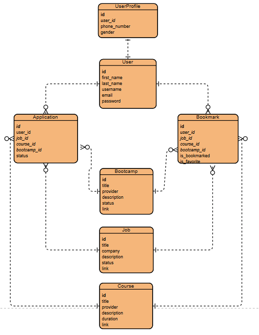

# A path to you career

# Description

A path to your Career, a solo project, represents the culmination of the skills I've acquired during the last module of my GA Software Engineering Bootcamp. It is a full-stack application that is designed to help users explore different career opportunities through job listings, courses, and bootcamps while keeping track of everything they applied to. The backend was developed using Django and PostgreSQL, while the frontend was built with React, JavaScript and Tailwind CSS.

# Getting started/Code Installation

To clone the project up and running on your local machine, follow these instructions:

### 1. Clone the repo:
- `git clone git@github.com:JoudKhalidAlosaimi/path-to-your-career-frontend.git`
- `git clone git@github.com:JoudKhalidAlosaimi/path-to-your-career-backend.git`

### 2.Install backend dependencies:
- `pipenv install`

### 3.Start the backend server:
- `python manage.py runserver`

### 4. In a new terminal, navigate to the frontend directory and install dependencies:
- `path-to-your-career-frontend`
- `npm install`

### 5. Start the React development server:
- `npm run dev`

# Technologies Used

- Backend: Python,Django Rest Framework, PostgreSQL
- Frontend: React, JavaScript, Tailwind CSS,SweetAlert2
- Dev Tools: Git, GitHub

# Backend Repo Link
- `https://github.com/JoudKhalidAlosaimi/path-to-your-career-frontend`

# ERD diagram

# Routing Table 

| Method | URL pattern               | Action                         |
| -------|:-------------------------:| ------------------------------:|
| POST   | /api/register/            | Register a new user            |
| GET    | /api/login/               |  login an existing user        |
| GET    | /api/profile/             | Get a user's profile details   |
| PUT    | /api/profile/             |  Update a user's profile info  |   
| Delete | /api/profile/:id/         | Delete a user's account        |
| GET    | /api/jobs                 | Get all the jobs               |
| POST   | /api/jobs/                | Create a new job               |
| GET    | /api/jobs/:id/            |  Get a single job              |
| PUT    | /api/jobs/:id/            | Edit an existing job           |
| DELETE | /api/jobs/:id/            |  Delete an existing job        |
| GET    | /api/courses/             |  Get all the courses           |
| POST   | /api/courses/             |  Create a new course           |
| GET    | /api/courses/:id/         |  Get a single course           |
| PUT    | /api/courses/:id/         | Edit an existing course        |
| DELETE | /api/courses/:id/         |  Delete an existing course     |
| GET    | /api/bootcamps            | Get all the bootcamps          |
| POST   | /api/bootcamps/           |  Create a new bootcamp         |
| GET    | /api/bootcamps/:id/       | Get a single bootcamp          |
| PUT    | /api/bootcamps/:id/       | Edit an existing bootcamp      |
| DELETE | /api/bootcamps/:id/       |  Delete an existing bootcamp   |
| GET    | /api/applications/        | Get all the applications       |
| POST   | /api/applications/        |  Create a new application      |
| GET    | /api/applications/:id/    |  Get a single application      |
| PUT    | /api/applications/:id/    |Edit an existing application    |
| DELETE | /api/applications/:id/    | Delete an existing application |
| GET    | /api/bookmarks/           | Get all the bookmarks          |
| POST   | /api/bookmarks/           |  Create a new bookmark         |
| GET    | /api/bookmarks/:id/       |  Get a single bookmark         |
| PUT    | /api/bookmarks/:id/       | Edit an existing bookmark      |
| DELETE | /api/bookmarks/:id/       | Delete an existing bookmark    |

# Future Improvements 
- Allow the user to search for a Job,Course,Bootcamp based on their field of interest.
- Include a section that contains common interview questions asked by different companies.
- Integrate AI system that suggests jobs,courses,bootcamps based on the user's skills.